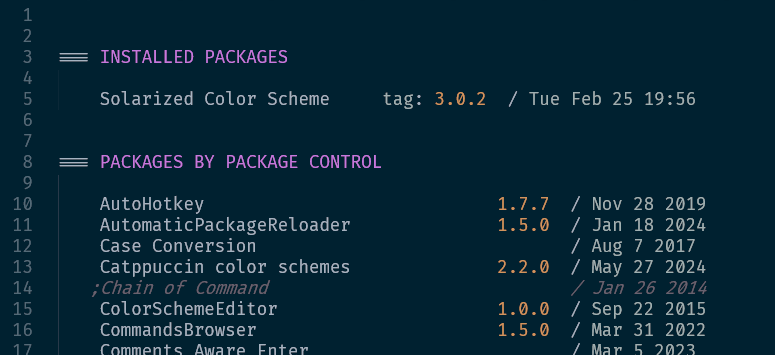

This is an add-on to Package Control, hence the X in the name.

```bash
git clone https://github.com/kaste/Package-x-Control.git "Package x Control"
```

Note the spaces in the name!  Package Control has them, so we do too.

##

This installs only one command "Package x Control: Dashboard".  Open the
dashboard and you will see all packages that you have on your system.



Initially all packages are either unmanaged packages or under the section
"PACKAGES BY PACKAGE CONTROL".  But this very add-on implements a third
way to install packages; it is not just an UI for the same thing.

So, now head over to packagecontrol.io and search for a color-scheme, really
anything not crucial or intricating for testing.

```
https://packagecontrol.io/packages/Solarized%20Color%20Scheme
```

Copy the url and paste it into the dashboard.  `ctrl+backspace` it to remove it
again.  Then go to a package on GitHub -- well, >90% market-share -- and copy

```
https://github.com/braver/Solarized
```

the URL over there, and paste it into the dashboard.  -- Now goto GitHub's
releases or tags subsite, and look at a previous tag.  Grab the URL

```
https://github.com/braver/Solarized/releases/tag/3.0.1
```

and paste it again.

Got it?  🤞


## Goals

An ASCII, GitSavvy like interface to Package Control.

Usually I browse packagecontrol.io or Github or the package control channel
for its pull requests.  If I see an interesting package, I don't want to
look that up again.  I have a web-url in the browser I can grab.

So, let's just paste that into the PCX dashboard to install it.

I want to install packages that are not (yet) registered.  E.g. to test them
while reviewing.  So, a git based install is required.

I want to quickly test out pull requests for packages.  I want to downgrade
if a version breaks my workflow.  I want to switch to a checked out (unpacked)
version to fix a bug myself.

Unpacking a package should configure the remotes.
Bonus point:  It would be nice to open such an unpacked package in a new
window. Using GitSavvy I could then create a fork, or add a fork and check
that out.

For abandoned packages, I want to switch to a fork (without unpacking) before
the registry is updated.  Maybe that never happens anyway.

If I get a notification from Github about a new release, I don't want to wait
for 3 hours.  I want to update immediately.

Ideally, release notes from Github could be used in addition to "messages.json".
These notes can be edited so I can fix my typos without making a new release.


## Uninstall

If you want to keep the installed packages, copy the package names to your
Package Control settings under `installed_packages`.  Then just delete this
package as always.
